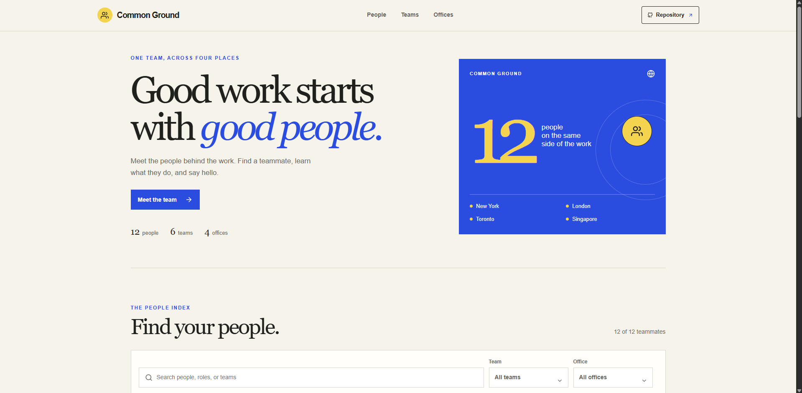

# Common Ground Team Directory

A simple, portrait-led directory for finding the people, teams, and offices behind the work.

**Live site:** https://a2rp.github.io/team-directory/

## What you can do

- Browse 12 sample teammates, their roles, teams, and office locations.
- Search by name, role, team, or office as you type.
- Narrow the list by team or office. The full-width select controls can be opened from anywhere inside the control.
- Browse names by first initial. Only initials that match the current search and filters are enabled.
- Open a teammate profile to read a short introduction, see their team and office, or start an email.
- Pick a team or office section to apply that filter and jump back to the people list.
- Clear filters from the search controls or the empty results message.
- Use the fixed header to move smoothly between People, Teams, and Offices.
- Use the floating Back to top button after scrolling more than 50 pixels.
- Follow the Repository link in the header or Source code link in the footer.

## How it works

The directory entries are stored in src/data/teamMembers.js. The app filters that list in the browser, so search, team, office, and first-letter filters work together immediately. The count above the people cards reflects the current results.

Profile cards open an accessible dialog. Close it with the close button, by clicking outside the dialog, or by pressing Escape. The page stops scrolling while the dialog is open, and focus returns to the selected profile card when it closes.

The team and office sections show matching counts. Selecting one applies its filter and scrolls back to the people list. The Clear filters control restores the full list.

The photos used in profile cards are stored in public/images. A few sample profiles use initials because this demonstration does not include a photo for every person.

## What it is useful for

Use this frontend as a small team's people page, an internal staff directory concept, or a starting point for a company directory. The sample emails and profile details are fictional. Replace them with approved team information before using the page with real people.

This is a static frontend. It does not have sign-in, a database, an editor, or a server connection. Changes to the sample directory require editing src/data/teamMembers.js and publishing a new build.

## Run it locally

```sh
npm install
npm run dev
```

Open the local URL printed by Vite. The project is configured to run from the /team-directory/ path, including in local development.

## Check and publish

```sh
npm run lint
npm run build
npm run deploy
```

The deploy script runs the production build first, then publishes the dist folder to the gh-pages branch. GitHub Pages serves the app at https://a2rp.github.io/team-directory/.

## Project files

- src/components contains the header, search controls, profile cards, profile dialog, team list, office list, footer, and Back to top button.
- Each component has an index.jsx file and a styles.module.css file in its own folder.
- src/App.jsx connects the page sections and manages search, filters, and the selected profile.
- src/App.module.css styles the page layout.
- src/index.css contains the shared reset and project color variables.
- src/data/teamMembers.js contains the sample directory data.
- public/images contains the locally stored profile photos.
- public/logo.png is used in the footer, and public/preview.png is used for social sharing.

## Future improvements

These are ideas for later work and are not implemented:

- Load approved staff details from a secure company directory.
- Add team and office contact pages.
- Let an authorized owner edit staff details through a form.
- Add profile links such as work samples, calendars, or chat handles.
- Add language and accessibility preferences for different teams.

## Links

- Portfolio: [https://www.ashishranjan.net](https://www.ashishranjan.net)
- GitHub: [https://github.com/a2rp](https://github.com/a2rp)
- CodePen: [https://codepen.io/ash1198](https://codepen.io/ash1198)
- LinkedIn: [https://www.linkedin.com/in/aashishranjan](https://www.linkedin.com/in/aashishranjan)
- Facebook: [https://www.facebook.com/theash.ashish/](https://www.facebook.com/theash.ashish/)
- YouTube: [https://www.youtube.com/@ashishranjan-ashz?sub_confirmation=1](https://www.youtube.com/@ashishranjan-ashz?sub_confirmation=1)
- Email: [mailto:ash.ranjan09@gmail.com](mailto:ash.ranjan09@gmail.com)

## Support

- Support: [https://a2rp-donation-page.netlify.app/](https://a2rp-donation-page.netlify.app/)
- Buy Me a Coffee: [https://buymeacoffee.com/ashishranjan](https://buymeacoffee.com/ashishranjan)
- Patreon: [https://www.patreon.com/ashishranjan](https://www.patreon.com/ashishranjan)
